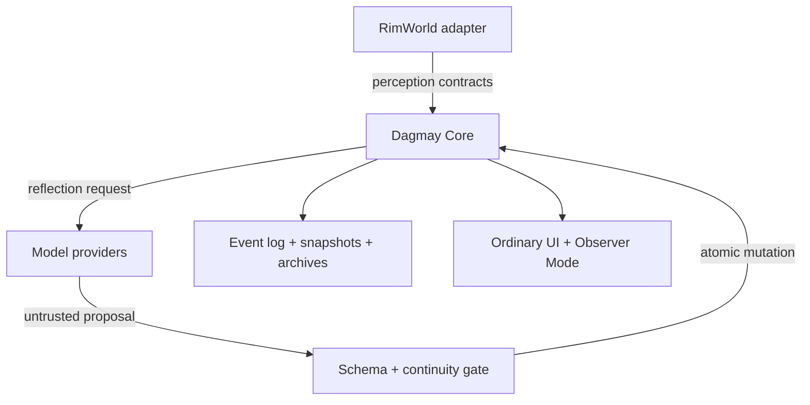
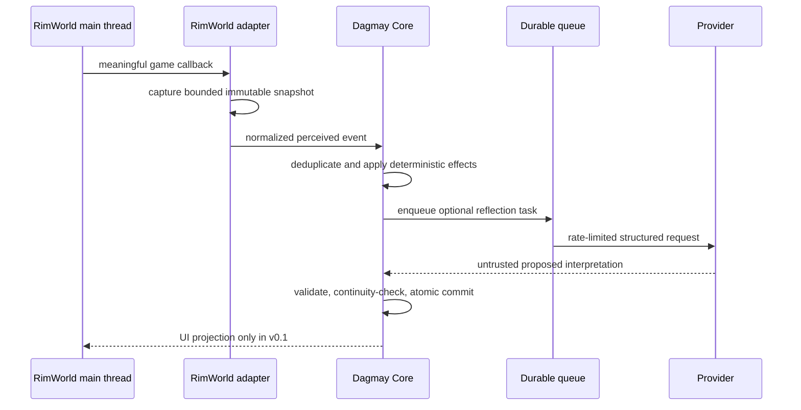

# 02 — System Architecture

**Status:** Living architecture; 0.1E Restricted Observer/runtime-control slice implemented  
**Architecture style:** ports and adapters with event-sourced provenance and validated state transitions

## Architectural thesis

Dagmay Core owns the individual. Environments supply bounded observations and, in later versions, execute approved actions. Model providers supply replaceable generative capabilities. Neither environment objects nor model context windows are canonical identity state.



## Dependency rules

1. `Dagmay.Core` references only general-purpose runtime libraries selected for long-term compatibility.
2. `Dagmay.Core` never references Verse, RimWorld, Unity, Harmony, Google SDK types, or UI frameworks.
3. Environment and provider interfaces are owned by `Dagmay.Core`; adapters implement them.
4. `Dagmay.RimWorld` maps game objects to immutable contracts and never persists raw object references.
5. `Dagmay.Providers` maps provider APIs to core request/response contracts.
6. All canonical mutations pass through one transactional validation boundary.
7. Observer tooling reads supported projections and audit records; it does not edit state directly.

### Version 0.1D composition boundary

`Dagmay.Core` now contains the provider-neutral request/proposal contracts, context governance, strict proposal decoder, validator, durable queue records, budgets, and reflection-store format. `Dagmay.Providers` contains fake and Google transports. `Dagmay.RimWorld` contains only the game-specific observation bridge plus the small runtime composition root that chooses `offline`, `fake`, or `google` mode.

This means a future Minecraft or Sims adapter does not reuse a RimTalk prompt history or a RimWorld pawn object as the person. It loads the same intrinsic Dagmay lineage and Core records, translates the new world's extrinsic conditions, and selects any compatible provider. RimTalk may later supply dialogue UI inside RimWorld, but it remains outside the identity authority boundary.

### Version 0.1E inspection boundary

`Dagmay.Core.Observer` defines immutable, provider- and game-neutral inspection projections for an individual, memories, committed reflections, scheduler usage, and system health. `Dagmay.RimWorld.Observer` renders those projections in an explicitly out-of-world Mod Settings surface. The UI receives text and identifiers, never live `Pawn` references, and has no general mutation channel back into Core.

The only administrative runtime operations in this slice are bounded host controls: pause/resume provider dispatch, change budgets, and enroll/pause/resume an individual. Enrollment pause is not deletion or lifecycle mutation. It preserves identity, lineage, intrinsic history, and archives; removes only that individual's waiting reflection tasks; and prevents an already-dispatched response from committing after the pause. These controls remain RimWorld host policy, while the individual's state remains Core-owned and portable.

The private view parses only locally validated proposals with a later durable `Committed` audit record. Unresolved or later-quarantined `PendingCommit` payloads are not presented as accepted autobiography. Snapshot creation is read-only, and the RimWorld UI caches it briefly to avoid reparsing diagnostic history every render frame.

## Proposed repository

```text
Dagmay/
├── README.md
├── LICENSE                         # owner decision required
├── Directory.Build.props          # nullable, warnings, language version, reproducibility
├── Directory.Packages.props       # centrally pinned package versions
├── Dagmay.sln
├── Dagmay.Core/
│   ├── Abstractions/               # clocks, ids, storage, provider, environment ports
│   ├── Contracts/                  # versioned DTOs and schema identifiers
│   ├── Identity/                   # identity seed, self-model, continuity lineage
│   ├── Lifecycle/                  # active, unavailable, dead, archived, forked
│   ├── Memory/                     # events, memories, retrieval, consolidation
│   ├── Beliefs/                    # propositions, evidence, confidence, contradiction
│   ├── Affect/                     # dimensions, appraisals, decay, influence
│   ├── Relationships/              # asymmetric person-to-person state
│   ├── Motivation/                 # values, needs, wants, goals, conflicts
│   ├── Reflection/                 # prompt-neutral tasks and proposed mutations
│   ├── Scheduling/                 # prioritization, budgets, queue, degradation
│   ├── Persistence/                # append log, snapshots, migrations, archives
│   ├── Validation/                 # schemas, ranges, invariants, commit gate
│   └── Observability/              # summaries, health, audit events, redaction
├── Dagmay.Providers/
│   ├── GoogleAIStudio/             # initial provider implementation
│   ├── Prompting/                  # versioned templates and context assembly
│   ├── Resilience/                 # timeout, bounded retry, rate/cost limits
│   ├── StructuredOutput/           # provider-specific schema adaptation
│   └── Local/                      # reserved for later local-model adapters
├── Dagmay.RimWorld/
│   ├── Bootstrap/                  # mod startup and dependency checks
│   ├── Perception/                 # main-thread snapshots and perspective filters
│   ├── Events/                     # Harmony observation points and normalization
│   ├── Mapping/                    # pawn data to core contracts
│   ├── PersistenceBridge/          # save identity, external data, recovery handshake
│   ├── Scheduling/                 # game lifecycle and main-thread commit pump
│   ├── UI/                         # pawn mind tab and colony overview
│   ├── Observer/                   # restricted diagnostics views
│   ├── Compatibility/              # DLC and RimTalk-specific isolation
│   └── Packaging/                  # About, Assemblies, Defs, load metadata
├── Dagmay.Tests/
│   ├── Unit/
│   ├── Contract/
│   ├── Persistence/
│   ├── Provider/
│   ├── Property/
│   ├── Stress/
│   ├── Fixtures/
│   └── ManualRimWorld/             # checklists; no redistributed game assemblies
├── docs/
└── tools/
    ├── SaveInspector/              # inspect/redact/export identity bundles
    ├── SchemaValidator/
    ├── DiagnosticsBundle/
    └── PackageMod/
```

The first code milestone should create only the folders needed to compile the smallest vertical slice. Reserved folders need not contain speculative frameworks.

## Core state boundaries

### Canonical identity state

Canonical state includes:

- stable `IndividualId` and lineage metadata;
- lifecycle status;
- identity seed and its source snapshot;
- current self-model and personality tendencies;
- beliefs with evidence and confidence;
- relationships from this individual's perspective;
- affective state;
- active values, wants, goals, and conflicts;
- memory indexes and autobiographical summaries; and
- schema/version metadata.

The canonical state excludes provider conversation history, raw game objects, UI state, live API tasks, and secrets.

### Event ledger

The append-only ledger records normalized perceived events, provider operations, proposed mutations, accepted/rejected mutations, migrations, lifecycle changes, and administrative repairs. Corrections append compensating records; they do not erase the original silently.

### Snapshots

Periodic snapshots accelerate loading. A snapshot is derived from a ledger position and carries a checksum, schema version, and last event identifier. Recovery can rebuild forward from the most recent valid snapshot.

## Event and reflection flow



### Critical thread rule

RimWorld and Unity objects are touched only on the game thread. The adapter captures the smallest immutable snapshot required for a task. Background workers operate exclusively on core contracts. Results are committed to core storage and surfaced to the game through a main-thread pump; Version 0.1 has no path back to pawn behavior.

## Identity initialization

The RimWorld adapter creates an `IdentitySeed` from information actually attached to a colonist:

- childhood and adulthood backstories;
- traits;
- skills, passions, and competency;
- ideology and roles;
- genes where applicable;
- current and historical relationships available from the game;
- age, health, injuries, and relevant circumstances; and
- origin world and adapter version.

The seed is evidence, not a completed personality. Core initialization derives a conservative baseline and records each derivation. A later model reflection may add interpretation but cannot replace the source snapshot.

## Scheduling and scale

“Once per real-world minute” is interpreted provisionally as a **scheduler opportunity**, not a guaranteed model call for every colonist. A per-pawn call each minute would produce more than 40 calls per minute in a large colony before event-triggered work.

The scheduler therefore has:

- durable priority queues;
- per-colony and per-provider concurrency caps;
- request, token, and optional cost budgets;
- deduplication and coalescing;
- aging so low-priority work is not starved forever;
- cancellation on unload without loss of durable work;
- backpressure and maximum queue bounds; and
- a deterministic fallback that records events and updates simple state without a model.

Priority order for Version 0.1:

1. death and lifecycle transitions;
2. severe harm, rescue, betrayal, and major relationship events;
3. unresolved high-salience experiences;
4. user-requested inspection or interaction;
5. ordinary consolidation; and
6. background reflection.

## Persistence and portability

RimWorld save data and Dagmay identity data have different needs. The adapter should store a small save-linked manifest in the RimWorld save and keep the versioned identity store in a dedicated Dagmay data location. Both share a save/world identifier and committed ledger position.

This avoids forcing large provider-neutral records into game serialization, but introduces a two-store consistency risk. The bridge must use atomic files, checksums, prior-version backups, and an explicit recovery screen when positions disagree. It may never guess silently which history is authoritative.

Exports contain:

- intrinsic identity state and lineage;
- event and memory provenance;
- environment-specific records in a named namespace;
- schema and adapter versions;
- lifecycle and activation status; and
- an integrity manifest.

An export is not automatically an active copy. Import and activation are separate operations.

## Structured model mutation

Providers return a versioned envelope containing concise interpretation, evidence references, confidence, and proposed operations from an allowlist. Validation checks:

- schema and version;
- individual and request identifiers;
- referenced events and people exist;
- allowed fields and operation count;
- numeric ranges and text bounds;
- stale base-state version;
- continuity constraints;
- forbidden lifecycle or administrative changes; and
- duplicate or replayed response identifiers.

All operations commit together or none commit. Human-readable provider text is never parsed as authority when the structured envelope fails.

## Known architecture tensions

1. **Continuity versus model replacement:** changing providers can alter interpretation and voice. Dagmay can protect state lineage, but behavioral continuity still needs regression tests, transition metadata, and potentially a calibration period.
2. **Game independence versus rich seeding:** RimWorld concepts can leak into core schemas. World-specific facts must remain namespaced while the core uses general concepts.
3. **Offline capture versus later interpretation:** reflecting hours later with a newer self-state can rewrite the emotional context. Events need occurrence-time context plus a distinct reflection timestamp.
4. **Privacy versus display:** Version 0.1 must display useful memories without making the normal mind tab an omniscient debugger. Disclosure policy is part of the projection layer.
5. **Portable intrinsic state versus hidden simulation knowledge:** cross-world transfer may be psychologically discontinuous. Migration needs an in-world transition policy rather than a raw import alone.
6. **Mod compatibility versus comprehensive observation:** Harmony patches can conflict or break after updates. Patch points must be isolated, diagnosable, and replaceable.
7. **External identity store versus RimWorld saves:** two-store consistency requires explicit recovery behavior and careful backups.

These are design risks to manage, not reasons to collapse the architecture.
